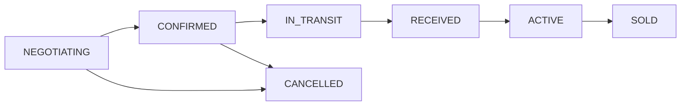

# 📚 Guia de Migração da API - BoviControl

## 🔄 Resumo das Mudanças

O sistema foi completamente refatorado para usar um modelo unificado `CattlePurchase` ao invés dos antigos modelos separados `PurchaseOrder` e `CattleLot`.

## ⚠️ Breaking Changes

### Modelos Removidos
- ‚ùå `PurchaseOrder` 
- ‚ùå `CattleLot`
- ‚úÖ **Novo:** `CattlePurchase` (modelo unificado)

### Endpoints Removidos
- ‚ùå `GET /api/v1/purchase-orders`
- ‚ùå `GET /api/v1/cattle-lots`
- ‚úÖ **Novo:** `GET /api/v1/cattle-purchases`

## üìã Mapeamento de Campos

### De PurchaseOrder ‚Üí CattlePurchase

| Campo Antigo | Campo Novo | Tipo |
|--------------|------------|------|
| `orderNumber` | `lotCode` | string |
| `totalAmount` | `purchaseValue` | number |
| `orderDate` | `purchaseDate` | Date |
| `status` | `status` | enum |

### De CattleLot ‚Üí CattlePurchase

| Campo Antigo | Campo Novo | Tipo |
|--------------|------------|------|
| `lotCode` | `lotCode` | string |
| `cattleLotId` | `purchaseId` | string |
| `quantity` | `currentQuantity` | number |
| `weight` | `currentWeight` | number |

## 🔗 Mudanças em Relacionamentos

### Partner (Parceiro)
```typescript
// ANTES
partner.purchaseOrdersAsVendor
partner.purchaseOrdersAsBroker

// DEPOIS
partner.cattlePurchasesAsVendor
partner.cattlePurchasesAsBroker
```

### PayerAccount (Conta Pagadora)
```typescript
// ANTES
payerAccount.purchaseOrders

// DEPOIS
payerAccount.cattlePurchases
```

### Expense (Despesa)
```typescript
// ANTES
expense.purchaseOrderId // Campo removido do banco

// DEPOIS
expense.purchaseId // Referencia CattlePurchase
```

### SaleRecord (Registro de Venda)
```typescript
// ANTES
saleRecord.cattleLotId

// DEPOIS
saleRecord.purchaseId
```

## 🎯 Novos Endpoints da API

### CattlePurchase - Endpoints Principais

#### Listar Compras
```http
GET /api/v1/cattle-purchases
```

#### Criar Compra
```http
POST /api/v1/cattle-purchases
Content-Type: application/json

{
  "vendorId": "string",
  "payerAccountId": "string",
  "purchaseDate": "2024-01-01",
  "animalType": "MALE",
  "initialQuantity": 100,
  "purchaseWeight": 15000,
  "carcassYield": 52,
  "pricePerArroba": 280.00,
  "paymentType": "CASH"
}
```

#### Registrar Recepção
```http
POST /api/v1/cattle-purchases/:id/reception
Content-Type: application/json

{
  "receivedDate": "2024-01-02",
  "receivedWeight": 14800,
  "actualQuantity": 99
}
```

#### Marcar como Confinado
```http
POST /api/v1/cattle-purchases/:id/confined
Content-Type: application/json

{
  "penAllocations": [
    {
      "penId": "string",
      "quantity": 50
    }
  ]
}
```

#### Registrar Morte
```http
POST /api/v1/cattle-purchases/:id/death
Content-Type: application/json

{
  "count": 1,
  "date": "2024-01-15"
}
```

## üìä Status do Ciclo de Vida


```mermaid
graph LR
    NEGOTIATING --> CONFIRMED
    CONFIRMED --> IN_TRANSIT
    IN_TRANSIT --> RECEIVED
    RECEIVED --> ACTIVE
    ACTIVE --> SOLD
    
    NEGOTIATING --> CANCELLED
    CONFIRMED --> CANCELLED
```

### Valores do Enum PurchaseStatus
- `NEGOTIATING` - Em negociação
- `CONFIRMED` - Confirmado
- `IN_TRANSIT` - Em tr√¢nsito
- `RECEIVED` - Recebido
- `ACTIVE` - Ativo/Confinado
- `SOLD` - Vendido
- `CANCELLED` - Cancelado

## 🔍 Exemplos de Migração

### Buscar Compras (Antes vs Depois)

**ANTES:**
```javascript
// Dois endpoints separados
const orders = await api.get('/purchase-orders');
const lots = await api.get('/cattle-lots');
```

**DEPOIS:**
```javascript
// Um √∫nico endpoint
const purchases = await api.get('/cattle-purchases');
```

### Criar Compra com Lote

**ANTES:**
```javascript
// 1. Criar ordem
const order = await api.post('/purchase-orders', orderData);

// 2. Criar lote vinculado
const lot = await api.post('/cattle-lots', {
  ...lotData,
  purchaseOrderId: order.id
});
```

**DEPOIS:**
```javascript
// Tudo em uma √∫nica chamada
const purchase = await api.post('/cattle-purchases', {
  ...orderData,
  ...lotData
});
```

## ✅ Checklist de Migração

- [ ] Atualizar todas as chamadas de API no frontend
- [ ] Mudar `purchaseOrderId` ‚Üí `purchaseId` em Expenses
- [ ] Mudar `cattleLotId` ‚Üí `purchaseId` em SaleRecords
- [ ] Atualizar relacionamentos de Partner
- [ ] Atualizar relacionamentos de PayerAccount
- [ ] Testar fluxo completo de compra até venda
- [ ] Atualizar documentação interna
- [ ] Treinar equipe nas novas APIs

## üìû Suporte

Em caso de dúvidas sobre a migração, consulte:
- Documentação Swagger: `http://localhost:3333/api/v1/api-docs`
- Logs de erro detalhados no backend

---

**Vers√£o:** 2.0.0  
**Data:** 30/12/2024  
**Status:** ✅ Migração Completa