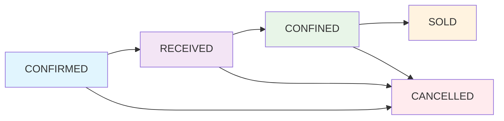

# 🎯 Modelo de Status Unificado - BoviControl

## 📊 Visão Geral da Proposta

### **Status Simplificados (5 totais)**
```typescript
enum PurchaseStatus {
  CONFIRMED   // ✅ Confirmado
  RECEIVED    // 📦 Recepcionado  
  CONFINED    // 🏠 Confinado
  SOLD        // 💰 Vendido
  CANCELLED   // ❌ Cancelado
}
```

## 🔄 Fluxo de Negócio Simplificado



## 📋 Definições Detalhadas

| Status | Descrição | Quando Ocorre | Próximo Status Possível |
|--------|-----------|---------------|------------------------|
| **CONFIRMED** | Compra aprovada e documentada | Após fechamento do negócio | RECEIVED, CANCELLED |
| **RECEIVED** | Animais recepcionados e pesados | Chegada ao confinamento | CONFINED, CANCELLED |
| **CONFINED** | Animais alocados nos currais | Após alocação em currais | SOLD, CANCELLED |
| **SOLD** | Processo concluído | Após venda/abate | - (final) |
| **CANCELLED** | Cancelado pelo usuário | Qualquer momento | - (final) |

## 🛠️ Implementação Técnica

### **1. Schema Prisma Simplificado**
```prisma
model CattlePurchase {
  id         String @id @default(cuid())
  lotCode    String @unique
  
  // CAMPO ÚNICO DE STATUS
  status     PurchaseStatus @default(CONFIRMED)
  
  // Dados principais
  vendorId   String
  quantity   Int
  // ... outros campos
  
  // Auditoria automática
  statusHistory StatusChangeLog[]
  
  @@map("cattle_purchases")
}

enum PurchaseStatus {
  CONFIRMED
  RECEIVED  
  CONFINED
  SOLD
  CANCELLED
}

// Auditoria obrigatória
model StatusChangeLog {
  id         String @id @default(cuid())
  purchaseId String
  fromStatus PurchaseStatus?
  toStatus   PurchaseStatus
  userId     String?
  reason     String?
  createdAt  DateTime @default(now())
  
  purchase   CattlePurchase @relation(fields: [purchaseId], references: [id])
  
  @@map("status_change_log")
}
```

### **2. Service com Validações Robustas**
```typescript
class CattlePurchaseService {
  // Transições válidas
  private static readonly VALID_TRANSITIONS: Record<PurchaseStatus, PurchaseStatus[]> = {
    CONFIRMED: ['RECEIVED', 'CANCELLED'],
    RECEIVED: ['CONFINED', 'CANCELLED'],
    CONFINED: ['SOLD', 'CANCELLED'],
    SOLD: [], // Estado final
    CANCELLED: [] // Estado final
  };

  async updateStatus(
    purchaseId: string, 
    newStatus: PurchaseStatus, 
    userId?: string,
    reason?: string
  ) {
    const purchase = await this.findById(purchaseId);
    
    // 1. Validar transição
    const allowedStatuses = CattlePurchaseService.VALID_TRANSITIONS[purchase.status];
    if (!allowedStatuses.includes(newStatus)) {
      throw new AppError(
        `Transição inválida: ${purchase.status} → ${newStatus}. ` +
        `Status permitidos: ${allowedStatuses.join(', ')}`, 
        400
      );
    }

    // 2. Validações específicas por status
    await this.validateStatusChange(purchase, newStatus);

    // 3. Executar transição com auditoria
    return await this.prisma.$transaction(async (tx) => {
      // Atualizar status
      const updated = await tx.cattlePurchase.update({
        where: { id: purchaseId },
        data: { 
          status: newStatus,
          updatedAt: new Date()
        }
      });

      // Log da mudança (obrigatório)
      await tx.statusChangeLog.create({
        data: {
          purchaseId,
          fromStatus: purchase.status,
          toStatus: newStatus,
          userId,
          reason: reason || `Mudança para ${newStatus}`
        }
      });

      return updated;
    });
  }

  private async validateStatusChange(purchase: CattlePurchase, newStatus: PurchaseStatus) {
    switch (newStatus) {
      case 'RECEIVED':
        if (!purchase.receivedDate) {
          throw new AppError('Data de recepção é obrigatória', 400);
        }
        break;
        
      case 'CONFINED':
        // Verificar se tem alocações de curral
        const allocations = await this.prisma.lotPenLink.count({
          where: { purchaseId: purchase.id, status: 'ACTIVE' }
        });
        if (allocations === 0) {
          throw new AppError('Lote deve ter alocações de curral para ser confinado', 400);
        }
        break;
        
      case 'SOLD':
        // Verificar se tem registro de venda
        const saleRecord = await this.prisma.saleRecord.findFirst({
          where: { purchaseId: purchase.id }
        });
        if (!saleRecord) {
          throw new AppError('Registro de venda é obrigatório', 400);
        }
        break;
    }
  }

  // Métodos de conveniência
  async markAsReceived(purchaseId: string, receptionData: ReceptionData) {
    // Registrar dados de recepção
    await this.registerReception(purchaseId, receptionData);
    // Avançar status
    return this.updateStatus(purchaseId, 'RECEIVED', receptionData.userId);
  }

  async markAsConfined(purchaseId: string, confinementData: ConfinementData) {
    // Alocar em currais
    await this.allocateToPens(purchaseId, confinementData.penAllocations);
    // Avançar status
    return this.updateStatus(purchaseId, 'CONFINED', confinementData.userId);
  }
}
```

### **3. Frontend Unificado e Elegante**
```typescript
// Configuração única para todos os componentes
const STATUS_CONFIG = {
  CONFIRMED: {
    label: 'Confirmado',
    description: 'Compra aprovada, aguardando recepção',
    variant: 'secondary' as const,
    color: 'bg-blue-50 text-blue-700 border-blue-200',
    icon: CheckCircle,
    actions: ['Recepcionar', 'Cancelar']
  },
  RECEIVED: {
    label: 'Recepcionado',
    description: 'Animais pesados e recepcionados',
    variant: 'default' as const,
    color: 'bg-purple-50 text-purple-700 border-purple-200',
    icon: Package,
    actions: ['Confinar', 'Cancelar']
  },
  CONFINED: {
    label: 'Confinado',
    description: 'Animais alocados nos currais',
    variant: 'default' as const,
    color: 'bg-green-50 text-green-700 border-green-200',
    icon: Home,
    actions: ['Vender', 'Cancelar']
  },
  SOLD: {
    label: 'Vendido',
    description: 'Processo finalizado com sucesso',
    variant: 'outline' as const,
    color: 'bg-orange-50 text-orange-700 border-orange-200',
    icon: DollarSign,
    actions: []
  },
  CANCELLED: {
    label: 'Cancelado',
    description: 'Processo cancelado pelo usuário',
    variant: 'destructive' as const,
    color: 'bg-red-50 text-red-700 border-red-200',
    icon: XCircle,
    actions: []
  }
} as const;

// Componente de Status Badge
const StatusBadge: React.FC<{ status: PurchaseStatus }> = ({ status }) => {
  const config = STATUS_CONFIG[status];
  const Icon = config.icon;
  
  return (
    <div className={`inline-flex items-center gap-2 px-3 py-1 rounded-full text-sm font-medium border ${config.color}`}>
      <Icon className="h-4 w-4" />
      {config.label}
    </div>
  );
};

// Hook para ações permitidas
const useStatusActions = (status: PurchaseStatus) => {
  return STATUS_CONFIG[status].actions;
};
```

## 🎛️ Interface de Usuário Intuitiva

### **Card de Lote com Status Visual**
```typescript
const LotCard: React.FC<{ lot: CattlePurchase }> = ({ lot }) => {
  const config = STATUS_CONFIG[lot.status];
  const actions = useStatusActions(lot.status);
  
  return (
    <Card className={`border-l-4 ${config.color.split(' ')[2]} hover:shadow-md transition-shadow`}>
      <CardHeader className="pb-2">
        <div className="flex justify-between items-start">
          <h3 className="font-semibold">{lot.lotCode}</h3>
          <StatusBadge status={lot.status} />
        </div>
        <p className="text-sm text-muted-foreground">{config.description}</p>
      </CardHeader>
      
      <CardContent>
        {/* Informações do lote */}
        <LotInfo lot={lot} />
        
        {/* Botões de ação contextual */}
        <div className="flex gap-2 mt-4">
          {actions.map(action => (
            <Button 
              key={action}
              size="sm" 
              onClick={() => handleStatusAction(lot.id, action)}
            >
              {action}
            </Button>
          ))}
        </div>
      </CardContent>
    </Card>
  );
};
```

## 📊 Benefícios do Modelo

### **✅ Vantagens Técnicas**
- **Simplicidade**: 3 status principais + 2 especiais
- **Consistência**: Uma fonte única de verdade
- **Validação**: Transições sempre validadas
- **Auditoria**: Histórico completo automático
- **Performance**: Menos queries, mais cache

### **✅ Vantagens de Negócio**
- **Clareza**: Status autoexplicativos
- **Fluxo Natural**: Segue processo real
- **Flexibilidade**: Cancelamento em qualquer etapa
- **Rastreabilidade**: Histórico completo
- **Confiabilidade**: Menos erros de estado

### **✅ Vantagens para Usuário**
- **Interface Limpa**: Cards visuais intuitivos
- **Ações Contextuais**: Botões relevantes por status
- **Feedback Visual**: Cores e ícones consistentes
- **Menos Confusão**: Menos opções, mais clareza

## 🚀 Plano de Migração

### **Fase 1: Preparação (2h)**
- [ ] Backup completo do banco
- [ ] Executar script de mapeamento de dados
- [ ] Validar dados inconsistentes

### **Fase 2: Backend (4h)**
- [ ] Atualizar schema Prisma
- [ ] Implementar service com validações
- [ ] Criar migrations
- [ ] Testes unitários

### **Fase 3: Frontend (3h)**
- [ ] Implementar STATUS_CONFIG
- [ ] Atualizar componentes
- [ ] Criar StatusBadge e hooks
- [ ] Ajustar filtros

### **Fase 4: Validação (1h)**
- [ ] Testes de integração
- [ ] Validação com usuários
- [ ] Ajustes finais

**Total: ~10 horas** (redução de 5h com a simplificação!)

---

Este modelo é **robusto**, **simples** e **escalável**. Elimina toda a confusão atual e cria uma base sólida para crescimento futuro.