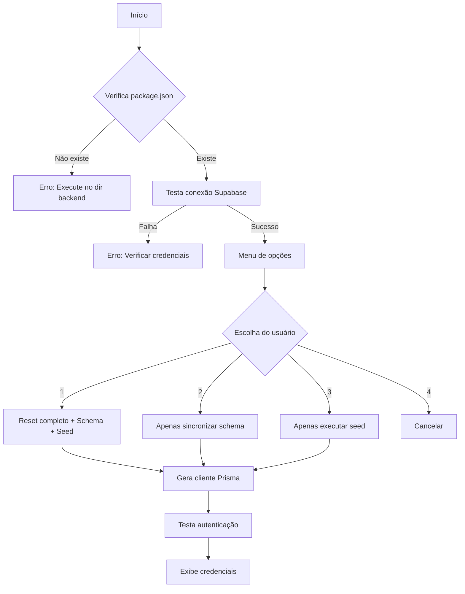

# Documentação Completa dos Scripts - Sistema Boi Gordo

## 📁 Estrutura de Scripts

```
aplicacao-boi-gordo/
├── backend/
│   └── scripts/
│       ├── setup-database.sh          # Configuração do banco de dados
│       ├── reset-admin.ts             # Reset de senha admin
│       ├── fix-typescript-errors.ts   # Correção de erros TypeScript
│       ├── fix-paths.js               # Correção de caminhos pós-build
│       ├── create-settings-tables.js  # Criação de tabelas Supabase
│       └── README.md                  # Documentação dos scripts
```

## 🚀 Guia Rápido de Uso

### Primeira Configuração do Sistema

```bash
# 1. Clone o repositório
git clone [repo-url]
cd aplicacao-boi-gordo

# 2. Instale dependências
npm install
cd backend && npm install

# 3. Configure variáveis de ambiente
cp .env.example .env
# Edite .env com suas credenciais

# 4. Configure o banco de dados
chmod +x scripts/setup-database.sh
./scripts/setup-database.sh
# Escolha opção 1 para setup completo

# 5. Crie tabelas de configurações
node scripts/create-settings-tables.js

# 6. Inicie o servidor
npm run dev
```

## 📝 Detalhamento dos Scripts

### 1. setup-database.sh

#### Propósito
Script principal para configuração e manutenção do banco de dados PostgreSQL/Supabase.

#### Fluxo de Execução


#### Código Interno
- Usa cores ANSI para output visual
- Função `check_status()` valida cada etapa
- Executa comandos Prisma:
  - `prisma migrate reset -f`
  - `prisma db push`
  - `prisma db seed`
  - `prisma generate`

#### Troubleshooting
| Problema | Solução |
|----------|---------|
| Permission denied | `chmod +x scripts/setup-database.sh` |
| Conexão recusada | Verificar DATABASE_URL no .env |
| Seed falha | Verificar prisma/seed.ts existe |

---

### 2. reset-admin.ts

#### Propósito
Criar ou resetar o usuário administrador do sistema.

#### Estrutura do Código
```typescript
// Importações
import { PrismaClient } from '@prisma/client';
import bcrypt from 'bcryptjs';

// Função principal
async function resetAdminPassword() {
  // 1. Hash da senha
  const hashedPassword = await bcrypt.hash('admin123', 10);
  
  // 2. Upsert do usuário
  const user = await prisma.user.upsert({
    where: { email: 'admin@boigordo.com' },
    update: { password: hashedPassword, isActive: true },
    create: { /* dados completos */ }
  });
}
```

#### Campos Configurados
- **email**: admin@boigordo.com
- **password**: admin123 (hash bcrypt)
- **name**: Administrador
- **role**: ADMIN
- **isActive**: true

#### Uso Avançado
```bash
# Executar diretamente
npx tsx scripts/reset-admin.ts

# Ou via npm script
npm run reset:admin
```

---

### 3. fix-typescript-errors.ts

#### Propósito
Correção automática de erros TypeScript comuns no projeto.

#### Correções Implementadas

##### 1. Adiciona tipos a callbacks
```typescript
// Antes
.reduce((sum, item) => sum + item.value, 0)

// Depois
.reduce((sum: any, item: any) => sum + item.value, 0)
```

##### 2. Cria tipos globais
```typescript
// src/types/global.d.ts
declare global {
  namespace Express {
    interface Request {
      user?: any;
      userId?: string;
      file?: any;
      files?: any;
    }
  }
}
```

##### 3. Atualiza package.json
```json
{
  "scripts": {
    "typecheck": "tsc --noEmit",
    "typecheck:strict": "tsc --noEmit -p tsconfig.strict.json",
    "build:check": "npm run typecheck && npm run build",
    "fix:types": "tsx scripts/fix-typescript-errors.ts"
  }
}
```

#### Análise de Impacto
- **Arquivos afetados**: Todos em src/repositories/*.ts
- **Mudanças**: ~100-200 linhas modificadas
- **Risco**: Baixo (adiciona only types)

---

### 4. fix-paths.js

#### Propósito
Corrigir imports com alias após compilação TypeScript.

#### Problema Resolvido
TypeScript compila:
```typescript
import { service } from '@/services/auth';
```

Para JavaScript inválido:
```javascript
const { service } = require('@/services/auth');
```

Script corrige para:
```javascript
const { service } = require('../services/auth');
```

#### Algoritmo
```javascript
function fixImports(dir) {
  // 1. Lista arquivos recursivamente
  // 2. Para cada .js:
  //    a. Conta níveis de diretório
  //    b. Calcula prefixo relativo
  //    c. Substitui @/ por caminho relativo
  // 3. Salva arquivo corrigido
}
```

#### Quando Executar
- Após `npm run build`
- Antes de deploy
- Se erros "Module not found" em produção

---

### 5. create-settings-tables.js

#### Propósito
Criar estrutura de tabelas para sistema de configurações no Supabase.

#### Tabelas Criadas

##### settings
```sql
CREATE TABLE settings (
  id UUID PRIMARY KEY,
  user_id UUID REFERENCES auth.users(id),
  setting_key VARCHAR(100) NOT NULL,
  setting_value JSONB NOT NULL,
  category VARCHAR(50) NOT NULL,
  created_at TIMESTAMP,
  updated_at TIMESTAMP,
  UNIQUE(user_id, setting_key)
);
```

##### backup_history
```sql
CREATE TABLE backup_history (
  id UUID PRIMARY KEY,
  user_id UUID REFERENCES auth.users(id),
  backup_type VARCHAR(50),
  backup_size BIGINT,
  status VARCHAR(20),
  file_path TEXT,
  error_message TEXT,
  created_at TIMESTAMP
);
```

#### RLS (Row Level Security)
```sql
-- Políticas aplicadas
- Users can view own settings
- Users can insert own settings
- Users can update own settings
- Users can delete own settings
```

#### Integração com Frontend
```typescript
// Em useSettings.ts
const { data } = await supabase
  .from('settings')
  .select('*')
  .eq('user_id', user.id);
```

## 🔄 Fluxo de Desenvolvimento

### Setup Inicial
```bash
1. setup-database.sh (opção 1)
2. create-settings-tables.js
3. npm run dev
```

### Após Mudanças no Schema
```bash
1. setup-database.sh (opção 2)
2. npx prisma generate
3. npm run dev
```

### Antes do Deploy
```bash
1. fix-typescript-errors.ts
2. npm run build
3. fix-paths.js
4. npm start
```

### Reset de Emergência
```bash
1. reset-admin.ts
2. Testar login
```

## 📊 Matriz de Compatibilidade

| Script | Node 16 | Node 18 | Node 20 | Windows | Mac | Linux |
|--------|---------|---------|---------|---------|-----|-------|
| setup-database.sh | ❌ | ✅ | ✅ | ❌ | ✅ | ✅ |
| reset-admin.ts | ✅ | ✅ | ✅ | ✅ | ✅ | ✅ |
| fix-typescript-errors.ts | ✅ | ✅ | ✅ | ✅ | ✅ | ✅ |
| fix-paths.js | ✅ | ✅ | ✅ | ✅ | ✅ | ✅ |
| create-settings-tables.js | ✅ | ✅ | ✅ | ✅ | ✅ | ✅ |

## 🛡️ Segurança

### Boas Práticas
1. **Nunca** commitar .env com credenciais reais
2. **Sempre** fazer backup antes de reset do banco
3. **Verificar** permissões de arquivo em produção
4. **Rotacionar** senhas após setup inicial

### Checklist de Segurança
- [ ] .env está no .gitignore
- [ ] Senhas foram alteradas dos padrões
- [ ] RLS está ativo no Supabase
- [ ] Scripts têm permissões apropriadas
- [ ] Logs não expõem informações sensíveis

## 🐛 Debug e Logs

### Ativar Debug Detalhado
```bash
# Para scripts bash
set -x
./scripts/setup-database.sh

# Para Node.js
DEBUG=* node scripts/create-settings-tables.js

# Para Prisma
DEBUG=prisma:* npx prisma db push
```

### Localização de Logs
- Prisma: `backend/prisma/migrations/`
- Node errors: Console output
- Bash scripts: Terminal output

## 📈 Métricas e Performance

| Script | Tempo Médio | Memória | CPU |
|--------|-------------|---------|-----|
| setup-database.sh | 30-60s | 100MB | Low |
| reset-admin.ts | 1-2s | 50MB | Low |
| fix-typescript-errors.ts | 5-10s | 150MB | Medium |
| fix-paths.js | 2-5s | 80MB | Low |
| create-settings-tables.js | 3-5s | 60MB | Low |

## 🔮 Roadmap de Scripts

### Planejados
- [ ] backup-database.sh - Backup automatizado
- [ ] health-check.js - Verificação de saúde do sistema
- [ ] migrate-data.ts - Migração de dados legados
- [ ] cleanup-logs.sh - Limpeza de logs antigos

### Em Consideração
- [ ] performance-test.js - Testes de carga
- [ ] security-audit.sh - Auditoria de segurança
- [ ] update-deps.js - Atualização de dependências

## 📚 Recursos Adicionais

### Documentação Externa
- [Prisma CLI](https://www.prisma.io/docs/reference/api-reference/command-reference)
- [Supabase Migrations](https://supabase.com/docs/guides/database/migrations)
- [TypeScript Compiler Options](https://www.typescriptlang.org/tsconfig)

### Scripts Úteis da Comunidade
```bash
# Verificar tamanho do bundle
npx webpack-bundle-analyzer

# Auditoria de segurança
npm audit

# Atualização interativa
npx npm-check-updates -i
```

## ❓ FAQ

**P: Posso executar os scripts em produção?**
R: Apenas fix-paths.js e create-settings-tables.js são seguros. Os demais podem apagar dados.

**P: Como adicionar novos usuários padrão?**
R: Edite `backend/prisma/seed.ts` e execute `setup-database.sh` opção 3.

**P: Scripts funcionam no Windows?**
R: Scripts .sh precisam de WSL ou Git Bash. Scripts .js/.ts funcionam nativamente.

**P: Como debugar erros de conexão?**
R: Verifique DATABASE_URL e SUPABASE_URL no .env, teste com `npx prisma db pull`.

## 📞 Suporte

Para problemas com scripts:
1. Verifique esta documentação
2. Consulte logs de erro
3. Verifique issues no GitHub
4. Contate a equipe de desenvolvimento

---

*Última atualização: 28 de Janeiro de 2025*
*Versão da documentação: 1.0.0*