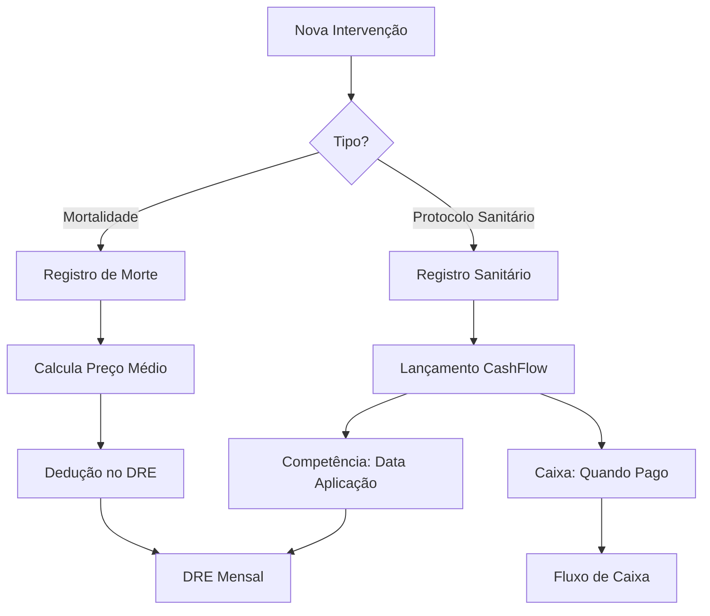

# Integração Financeira - Mortalidade e Protocolo Sanitário
## Sistema BoiGordo

### 1. REGISTRO DE MORTALIDADE 💀

#### Conceito e Impacto Financeiro
- **Natureza**: DEDUÇÃO no DRE (Competência)
- **Não gera**: Movimentação de caixa
- **Afeta**: Resultado econômico do período
- **Base de cálculo**: Preço médio de compra do(s) lote(s) no curral

#### Estrutura de Dados

```typescript
interface MortalityRecord {
  id: string;
  penId: string;              // Curral onde ocorreu
  quantity: number;           // Quantidade de mortes
  date: Date;                 // Data do óbito (competência)
  cause: string;              // Causa da morte
  
  // Calculados automaticamente
  estimatedLoss: number;      // Perda estimada em R$
  averageCostPerHead: number; // Custo médio por cabeça
  
  // Rastreabilidade
  lotsAffected: string[];     // IDs dos lotes afetados
  userId: string;             // Quem registrou
  attachments?: string[];     // Fotos, laudos veterinários
}
```

#### Cálculo da Perda por Mortalidade

```typescript
async function calculateMortalityLoss(penId: string, quantity: number): Promise<number> {
  // 1. Buscar todos os lotes no curral
  const lotsInPen = await prisma.lotPenLink.findMany({
    where: { 
      penId,
      status: 'ACTIVE' 
    },
    include: {
      cattlePurchase: true
    }
  });

  if (lotsInPen.length === 0) {
    throw new Error('Nenhum lote ativo no curral');
  }

  // 2. Calcular preço médio ponderado
  let totalValue = 0;
  let totalAnimals = 0;

  for (const link of lotsInPen) {
    const lot = link.cattlePurchase;
    const lotValue = lot.purchaseValue + lot.freightCost + lot.commission;
    const animalsInPen = link.quantity;
    
    totalValue += lotValue * (animalsInPen / lot.currentQuantity);
    totalAnimals += animalsInPen;
  }

  const averageCostPerHead = totalValue / totalAnimals;
  
  // 3. Calcular perda total
  const totalLoss = averageCostPerHead * quantity;

  return {
    totalLoss,
    averageCostPerHead,
    lotsAffected: lotsInPen.map(l => l.cattlePurchase.id)
  };
}
```

#### Lançamento no DRE

```typescript
// Estrutura no DRE
{
  RECEITAS: {
    vendaGado: 1500000,
    outrasReceitas: 50000
  },
  DEDUCOES: {
    mortalidade: 45000,    // ← ENTRA AQUI
    descontos: 10000
  },
  RECEITA_LIQUIDA: 1495000, // Receitas - Deduções
  CUSTOS: {
    compraGado: 1000000,
    alimentacao: 200000
  },
  // ...
}
```

---

### 2. PROTOCOLO SANITÁRIO 💉

#### Conceito e Impacto Financeiro
- **Natureza**: DESPESA OPERACIONAL
- **Regime**: COMPETÊNCIA (data da aplicação) + CAIXA (quando pago)
- **Gera**: Lançamento em CashFlow
- **Categoria**: Saúde Animal / Medicamentos

#### Estrutura de Dados

```typescript
interface HealthProtocol {
  id: string;
  type: 'VACINA' | 'MEDICAMENTO' | 'VERMIFUGO' | 'SUPLEMENTO';
  name: string;               // Nome do protocolo
  
  // Aplicação
  applicationDate: Date;      // Data da aplicação (competência)
  penId?: string;            // Curral específico
  lotId?: string;            // Lote específico
  animalCount: number;        // Quantidade de animais tratados
  
  // Financeiro
  costPerAnimal: number;      // Custo por cabeça
  totalCost: number;         // Custo total
  
  // Pagamento
  supplierId: string;        // Fornecedor
  dueDate: Date;            // Vencimento
  paymentStatus: 'PENDING' | 'PAID';
  paymentDate?: Date;       // Data do pagamento (caixa)
  
  // Veterinário
  veterinarianId?: string;   // Veterinário responsável
  prescription?: string;     // Receituário
  notes?: string;
}
```

#### Geração de Lançamentos

```typescript
async function createHealthProtocolWithFinancial(data: HealthProtocolInput) {
  // 1. Criar registro do protocolo
  const protocol = await prisma.healthProtocol.create({
    data: {
      ...data,
      totalCost: data.costPerAnimal * data.animalCount
    }
  });

  // 2. Gerar lançamento no CashFlow
  const cashFlow = await prisma.cashFlow.create({
    data: {
      type: 'EXPENSE',
      categoryId: 'health-animal', // Categoria específica
      accountId: data.payerAccountId,
      
      // Competência
      date: data.applicationDate,
      dueDate: data.dueDate,
      
      // Descrição
      description: `${data.type}: ${data.name} - ${data.animalCount} animais`,
      amount: protocol.totalCost,
      
      // Status inicial
      status: 'PENDING',
      
      // Referências
      reference: `PROTOCOL-${protocol.id}`,
      supplier: data.supplierName,
      
      // Metadados
      tags: ['saude-animal', data.type.toLowerCase()],
      attachments: data.prescription ? [data.prescription] : []
    }
  });

  return { protocol, cashFlow };
}
```

---

### 3. INTEGRAÇÃO COMPLETA NO SISTEMA

#### Fluxo de Integração



#### Validação da Integração

```typescript
// Serviço de validação
class FinancialIntegrationValidator {
  
  async validateMortalityIntegration(mortalityId: string) {
    const mortality = await prisma.mortalityRecord.findUnique({
      where: { id: mortalityId }
    });
    
    // Validações
    const checks = {
      hasValidPen: !!mortality.penId,
      hasCalculatedLoss: mortality.estimatedLoss > 0,
      hasAffectedLots: mortality.lotsAffected.length > 0,
      appearsInDRE: await this.checkDREIntegration(mortality),
      doesNotAffectCashFlow: await this.checkNoCashFlowEntry(mortality)
    };
    
    return {
      isValid: Object.values(checks).every(v => v === true),
      checks
    };
  }
  
  async validateHealthProtocolIntegration(protocolId: string) {
    const protocol = await prisma.healthProtocol.findUnique({
      where: { id: protocolId },
      include: { cashFlow: true }
    });
    
    const checks = {
      hasValidProtocol: !!protocol,
      hasCashFlowEntry: !!protocol.cashFlow,
      correctCompetenceDate: protocol.cashFlow?.date === protocol.applicationDate,
      correctDueDate: protocol.cashFlow?.dueDate === protocol.dueDate,
      correctAmount: protocol.cashFlow?.amount === protocol.totalCost,
      correctCategory: protocol.cashFlow?.categoryId === 'health-animal'
    };
    
    return {
      isValid: Object.values(checks).every(v => v === true),
      checks
    };
  }
}
```

---

### 4. INTERFACE DE REGISTRO INTEGRADO

```typescript
// Componente React para registro integrado
const InterventionRegistration = () => {
  const [type, setType] = useState<'MORTALITY' | 'HEALTH_PROTOCOL'>();
  const [integrateFinancial, setIntegrateFinancial] = useState(true);
  
  const handleSubmit = async (data: any) => {
    if (type === 'MORTALITY') {
      // Calcula perda
      const loss = await calculateMortalityLoss(data.penId, data.quantity);
      
      // Registra mortalidade
      await createMortalityRecord({
        ...data,
        estimatedLoss: loss.totalLoss,
        integrateFinancial // Flag para integração
      });
      
      toast({
        title: 'Mortalidade registrada',
        description: `Perda estimada: ${formatCurrency(loss.totalLoss)}. DRE atualizado.`
      });
      
    } else if (type === 'HEALTH_PROTOCOL') {
      // Cria protocolo com lançamento
      const result = await createHealthProtocolWithFinancial(data);
      
      toast({
        title: 'Protocolo sanitário registrado',
        description: `Lançamento de ${formatCurrency(result.protocol.totalCost)} criado no fluxo de caixa.`
      });
    }
  };
  
  return (
    <Card>
      <CardHeader>
        <CardTitle>Nova Intervenção</CardTitle>
        <div className="flex items-center gap-4">
          <Label>Integrar ao financeiro?</Label>
          <Switch
            checked={integrateFinancial}
            onCheckedChange={setIntegrateFinancial}
          />
          {integrateFinancial && (
            <Badge variant="outline">
              {type === 'MORTALITY' ? 'Dedução no DRE' : 'Lançamento em Caixa/Competência'}
            </Badge>
          )}
        </div>
      </CardHeader>
      {/* Formulário específico por tipo */}
    </Card>
  );
};
```

---

### 5. RELATÓRIOS INTEGRADOS

#### DRE com Mortalidade

```sql
-- Query para DRE incluindo mortalidade
SELECT 
  -- Receitas
  SUM(CASE WHEN type = 'INCOME' THEN amount ELSE 0 END) as receita_bruta,
  
  -- Deduções (Mortalidade)
  (SELECT SUM(estimatedLoss) 
   FROM MortalityRecord 
   WHERE MONTH(date) = MONTH(CURRENT_DATE)) as deducao_mortalidade,
  
  -- Receita Líquida
  (receita_bruta - deducao_mortalidade) as receita_liquida,
  
  -- Custos (incluindo protocolos sanitários)
  SUM(CASE 
    WHEN type = 'EXPENSE' AND categoryId = 'health-animal' 
    THEN amount ELSE 0 
  END) as custo_sanitario,
  
  -- Outros custos...
FROM CashFlow
WHERE MONTH(date) = MONTH(CURRENT_DATE)
  AND status != 'CANCELLED';
```

#### Dashboard de Saúde do Rebanho

```typescript
const HealthDashboard = () => {
  const { data: mortality } = useMortalityStats();
  const { data: protocols } = useHealthProtocols();
  
  return (
    <Grid>
      <Card>
        <CardTitle>Taxa de Mortalidade</CardTitle>
        <CardContent>
          <div className="text-3xl font-bold text-red-600">
            {mortality.rate}%
          </div>
          <div className="text-sm text-muted-foreground">
            Perda acumulada: {formatCurrency(mortality.totalLoss)}
          </div>
        </CardContent>
      </Card>
      
      <Card>
        <CardTitle>Investimento em Saúde</CardTitle>
        <CardContent>
          <div className="text-3xl font-bold text-green-600">
            {formatCurrency(protocols.totalInvested)}
          </div>
          <div className="text-sm text-muted-foreground">
            {protocols.protocolsApplied} protocolos aplicados
          </div>
        </CardContent>
      </Card>
      
      <Card>
        <CardTitle>ROI Sanitário</CardTitle>
        <CardContent>
          <div className="text-3xl font-bold">
            {calculateROI(protocols.totalInvested, mortality.lossAvoided)}%
          </div>
          <div className="text-sm text-muted-foreground">
            Perdas evitadas: {formatCurrency(mortality.lossAvoided)}
          </div>
        </CardContent>
      </Card>
    </Grid>
  );
};
```

---

### 6. REGRAS DE NEGÓCIO

#### Mortalidade
✅ **SEMPRE** dedução no DRE (não é despesa)
✅ **NUNCA** gera movimentação de caixa
✅ **SEMPRE** usa preço médio ponderado dos lotes
✅ **SEMPRE** registra na data do óbito (competência)

#### Protocolo Sanitário
✅ **SEMPRE** gera lançamento em CashFlow
✅ **COMPETÊNCIA** na data da aplicação
✅ **CAIXA** quando efetivamente pago
✅ **CATEGORIA** específica para rastreabilidade

#### Integração Opcional
✅ Usuário pode optar por não integrar
✅ Sistema mantém log de decisão
✅ Possível integrar posteriormente
✅ Auditoria completa das integrações

---

### 7. BENEFÍCIOS DA INTEGRAÇÃO

1. **Visão Completa**: Todas as operações refletidas financeiramente
2. **Rastreabilidade**: Link entre operação e impacto financeiro
3. **Decisões**: ROI de investimentos em saúde animal
4. **Compliance**: DRE correto com todas as deduções
5. **Gestão**: Identificação de currais problemáticos